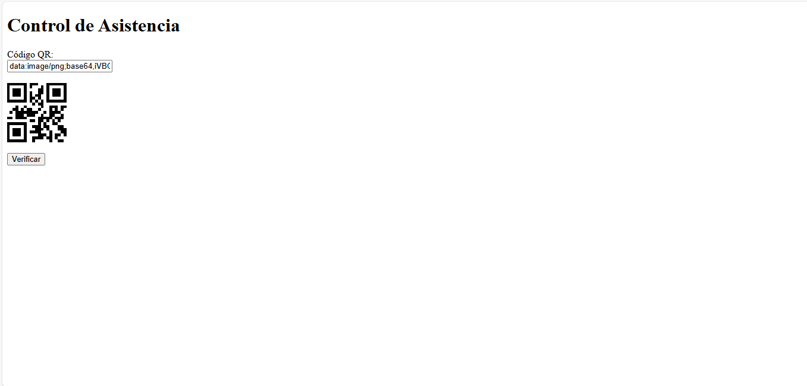

# Simulación de Sistema de Gestión de Gimnasio

Este proyecto simula un sistema de gestión de gimnasio con las siguientes funcionalidades principales:

* Registro y gestión de clientes
* Control de asistencia mediante código QR
* Administración de pagos y vencimientos
* Gestión de mantenimiento de equipos

## Descripción del Proyecto

Este proyecto es una simulación de un sistema de gestión de gimnasio. Se han creado interfaces web básicas para representar las funcionalidades clave de un sistema real. El objetivo es demostrar la comprensión de los casos de uso y la capacidad de simular interfaces de usuario.

## Casos de Uso

### 1. Registro y Gestión de Clientes

* Permite registrar nuevos clientes con información básica como nombre y correo electrónico.

### 2. Control de Asistencia mediante Código QR

* Simula el registro de asistencia de los clientes mediante códigos QR.
* Permite ingresar un código QR simulado y registrar la asistencia.

### 3. Administración de Pagos y Vencimientos

* Permite visualizar una lista de pagos y vencimientos de los clientes.

### 4. Gestión de Mantenimiento de Equipos

* Permite visualizar el estado de los equipos del gimnasio.

## Instrucciones de Uso

1.  Abre los archivos HTML en tu navegador web para visualizar las interfaces.
2.  Utiliza los formularios y botones para interactuar con las interfaces.
3.  Para el control de asistencia QR, ingresa cualquier texto en el campo "Código QR" para generar un código QR simulado.
4.  Las capturas de pantalla de cada caso de uso se encuentran en la carpeta capturas/img/.

## Capturas de Pantalla

### Registro de Clientes

### Control de Asistencia QR

### Administración de Pagos

### Mantenimiento de Equipos

## Tecnologías Utilizadas

* HTML
* JavaScript (con la librería qrcodejs)